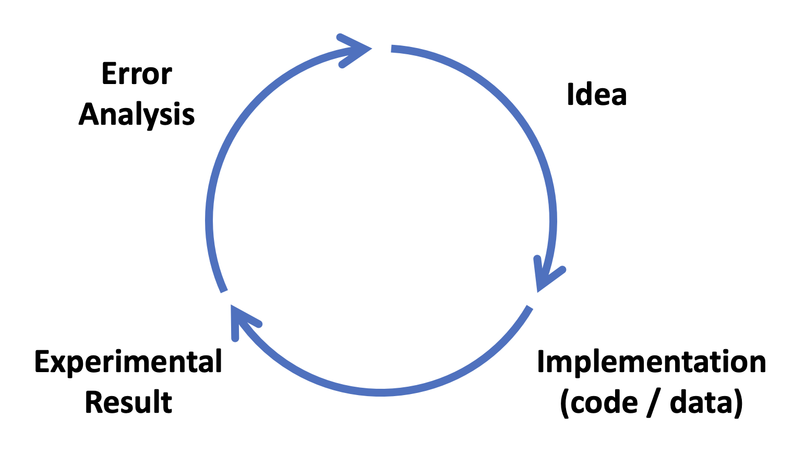

Prompt engineering describes the process of giving instructions to large language models (LLMs) for a specific purpose. These instructions, or prompts, are written in natural language, which makes building chat-based applications accessible to people without deep learning expertise. Using prompt engineering with LLMs enables developers to harness the power of LLMs without having to train or fine-tune the underlying model itself. This paradigm facilitates rapid prototyping, iteration, and deployment. Like any subfield, there are techniques and considerations which lend themselves to optimal performance. [DeepLearning.AI](https://www.deeplearning.ai/) offers a short course called [ChatGPT Prompt Engineering for Developers](https://learn.deeplearning.ai/chatgpt-prompt-eng/) which contains best practices for prompt engineering across a number of common use cases. This post contains my notes from the course.

## Introduction

There are two main types of LLMs:

- Base
  - Predict next token based on training data
  - Train through supervised learning
- Instruction tuned
  - Fine tune on examples where output follows an input instruction
  - Obtain human ratings of outputs
  - Increase probability of desired outputs using Reinforcement Learning with Human Feedback (RLHF)

Instruction tuned LLMs empower developers to quickly build applications. Think about prompt engineering as giving instructions to a person who is smart but doesn't necessarily know the details of your field, like a college intern working at your company. For example, if you want a summary of Alan Turing's bio, specify if you are interested in his personal or professional life.

## Guidelines

There are two main principles for prompt engineering:

1. Write clear and specific instructions
2. Give the model time to think

Longer prompts provide more clarity and context. Delimiters around user input avoids prompt injection, where user instructions conflict with system instructions. Triple quotes, triple backticks, angle brackets, and a series of hashes are good choices for delimiters.

Tactics for Principle 1 (Write clear and specific instructions)

- Use delimiters
- Ask for structured output
- Check whether conditions are satisfied, i.e. check assumptions required to do the task
- Use few shot prompting to provide a few examples of inputs with desired outputs

Tactics for Principle 2 (Give the model time to think)

- Specify steps required to complete a task
- Instruct the model to work out its own solution before rushing to a conclusion

Model limitations:

- Hallucinations - realistic-sounding responses which are not based in fact
- TODO: review lesson for additional limitations

## Iterative Prompt Development

Guidelines

- Be clear and concise
- Analyze why results do not give the desired output
- Refine the idea and the prompt
